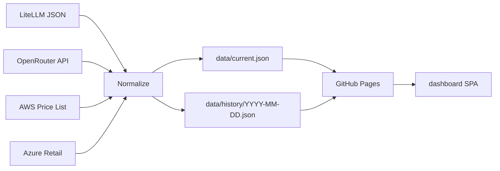

# token-price-index — Architecture

## Pipeline

LiteLLM JSON provides broad model coverage and context-window metadata. OpenRouter API adds live aggregator pricing. AWS Price List and Azure Retail add regional hyperscaler price records. Normalize converts every source into the unified schema, then writes `data/current.json` and `data/history/YYYY-MM-DD.json`. GitHub Pages serves those public artefacts to the dashboard SPA.

## Refresh cadence

The refresh cadence is daily at 17:00 UTC (~03:00 AEST), matching `aws-well-architected-corpus` for a consolidated overnight refresh window.

## Data model

The public contract is a flat array of normalized price records. See [SPEC.md#unified-schema](./SPEC.md#unified-schema) for the authoritative field list and invariants.

## Hosting

The project uses the pure GitHub stack: Actions for compute, Pages as the CDN, and Releases for versioning.

| Component | Free tier | Project usage | Cost |
|-----------|-----------|---------------|------|
| GitHub Actions | 2000 min/month (public repos: unlimited) | ~5 min/day = 150 min/month | $0 |
| GitHub Pages | 100 GB bandwidth/month soft | ~10 MB JSON + ~500 KB SPA per visit | $0 |
| GitHub Releases | Unlimited for public repos | ~1 release/day on content change | $0 |
| DNS (Cloudflare CNAME) | Existing zone | One CNAME record | $0 |
| **Total** | | | **$0/month** |

## Time-series storage

Git history is the database. Each refresh updates the current artefact and writes a dated history snapshot, so price movement is visible through normal git diffs. The `aws-ip-ranges` repository pattern, with 650+ commits over 3 years, demonstrates that a public repo can serve a durable, diffable time-series dataset.

## Why not AWS

Decision D2 from the ISA is Steve's hard cost-neutral constraint. This project has no AWS-sovereignty narrative to justify an AWS substrate; `feedback_aws_native_default.md` applies to AWS-resident projects, and this project is explicitly not AWS-resident, so there is no conflict.
