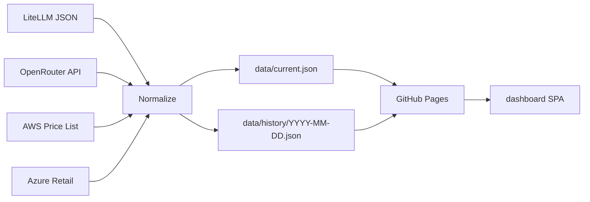

# token-price-index

Machine-readable, time-versioned LLM token pricing across direct providers, aggregators, and hyperscalers.

## Live URL

Target: `https://tokenindex.sjramblings.io` (not deployed yet — landing post-PR #5).

## Project purpose

There is no machine-readable, time-versioned, multi-hyperscaler view of LLM token pricing today. Pricing pages, API catalogs, and third-party tables exist, but they are not consistently normalized into a public dataset that can be diffed over time.

The hyperscaler dimension is especially hard to see. The same model may be available directly, through Bedrock, through Vertex AI, through Azure OpenAI, or through an aggregator, but most pricing dashboards flatten that deployment context away.

This repo fills the gap as both dashboard and dataset. The public JSON files are the contract, and git history is the time-series database.

## Data sources

| Source | URL | Auth | Scope |
|--------|-----|------|-------|
| LiteLLM | `https://raw.githubusercontent.com/BerriAI/litellm/main/model_prices_and_context_window.json` | None | ~1500 models, MIT-licensed |
| OpenRouter | `https://openrouter.ai/api/v1/models` | None | ~300 models, live API pricing |
| AWS Price List Bulk API | `https://pricing.us-east-1.amazonaws.com/offers/v1.0/aws/AmazonBedrock/current/region_index.json` | None | Bedrock per-region |
| Azure Retail Prices API | `https://prices.azure.com/api/retail/prices` | None | Azure OpenAI per-region |

LiteLLM is MIT-licensed; OpenRouter, AWS, and Azure terms apply to their data; this project's tooling is MIT.

## How it works

Scheduled refreshes collect upstream pricing, normalize it into one schema, write a current snapshot plus a dated history file, and publish both through GitHub Pages for the dashboard SPA.



## Quick start

```bash
bun install
just refresh   # PR #2+ will wire this up
```

## Roadmap

- PR #1 — Scaffold (this PR): docs, tooling, directory structure (F1)
- PR #2 — Data pipeline: LiteLLM + OpenRouter fetchers + Normalize + Verify (F2)
- PR #3 — GitHub Actions daily refresh + commit-on-change + release (F3)
- PR #4 — Vite + React dashboard with four pages (F4)
- PR #5 — Hosting + custom domain `tokenindex.sjramblings.io` (F5)
- PR #6 — Hyperscaler-pivot view (the differentiator) (F6)
- PR #7 — Regional pricing (AWS Bedrock + Azure OpenAI per-region) (ISA § H)

## License

MIT — see [LICENSE](./LICENSE)

## Contributing

Issues and PRs welcome.
